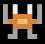
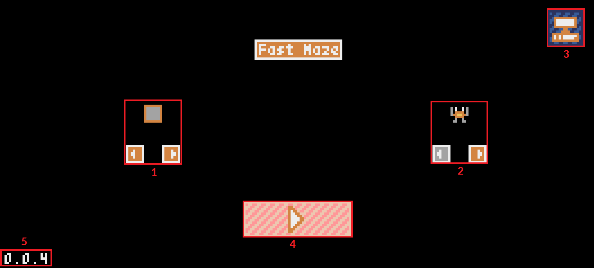
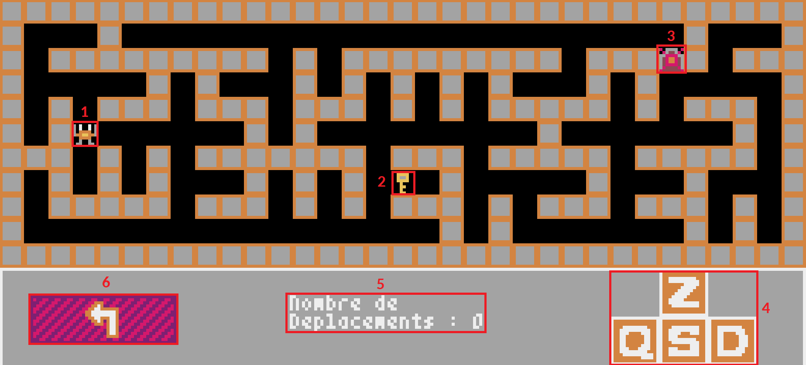
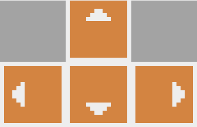

# Jouer

[Clique ici](https://osiris-sio.github.io/HTML_Fast-Maze/) pour jouer sur le navigateur, que vous soyez sur PC ou Smartphone !
Vous pouvez également jouer hors ligne en installant game.html sur PC et Smartphone ([ici](https://github.com/Osiris-Sio/Fast-Maze/blob/main/game.html)).

# Description et Caractéristiques

  

Plongez dans l'excitation de l'aventure avec Fast Maze, un jeu captivant où votre reflection est honoré dans un petit labyrinthe ! Votre objectif est simple : récupérer la clé dans le labyrinthe et trouver le chemin vers la sortie.

Chaque fois que vous lancez une nouvelle partie, le labyrinthe est généré de manière aléatoire, vous assurant une expérience unique à chaque fois.

Avec des graphismes colorés et retro, Fast Maze est le jeu parfait pour les amateurs de défis rapides. Êtes-vous prêt à affronter le labyrinthe et à y échapper ?

# Menu

1. Changer la couleur du contour des murs (15 couleurs)
2. Changer le personnage (12 personnages)
3. Changer la plateforme. Permet de désactiver l'affichage de la souris et de prendre en charge le tactile. 
En mode PC, la croix directionnelle d'une manette est prise en compte.
4. Bouton pour lancer une partie.
5. La version du jeu.

# Partie

1. Votre personnage (8x8 pixels).
2. La clé pour ouvrir la porte.
3. La porte fermé. Ouverte après avoir récupéré la clé.
4. Indication des touches à appuyer pour bouger votre personnage.
5. Les informations de la partie. Cette zone indique le nombre de déplacement que vous avez fait.
6. Bouton pour retourner au menu.

_Remarque :_

Pour le mode "Smartphone", l'indication des touches changera en une croix directionnelle tactile.

# Réseaux Sociaux

[Réseaux sociaux 🌍](https://linktr.ee/osiris_sio)

________

Par AMEDRO Louis (alias Osiris Sio)

Studio : I.V.L Games (Innovation, Vision and Liberty Games)

licence CC BY SA
